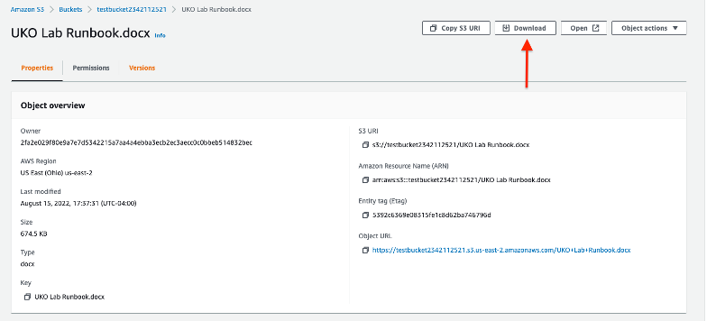

author: Juan Dos Santos
id: Cloud Innovation Summit - UKO
categories: Sample
tags: medium
status: Published

# IBM Cloud Innovation Summit - Unified Key Orchestrator Lab

## Welcome

## Introduction

Welcome to the HPCS Unified Key Orchestrator hands-on lab! In this lab, you'll have a chance to work with a live IBM Cloud and AWS environment and experience the functionality of the IBM Cloud Hyper Protect Crypto Services Unified Key Orchestrator (HPCS UKO for short).

Unified Key Orchestrator is an innovative multi-cloud key management solution offered as a managed service. Built on the 'Keep Your Own Key' technology, Unified Key Orchestrator helps enterprises manage their data encryption keys across multiple key stores across multiple clouds environments, including keys managed on-premises, on IBM Cloud, AWS and Microsoft Azure.

This lab runbook contains all the necessary steps and tools to complete the lab on your own, but if you get stuck, we'll keep the environment live for a few days so you can continue your learning after this session. There is also a video at the end of this document that showcases what we'll be going through today.

Let's get started!

## Scenario

You are the chief security officer at a midsize bank, SecureBank, Ltd. SecureBank is a local bank that strives to provide a modern and unique experience to its customers. They may be small, but they're ambitious, and they have lofty goals when it comes to testing and releasing new software in the form of new features for their customers.

In the effort of providing their customers with a holistic financial services platform, SecureBank recently acquired a cutting-edge trading platform, XPertTrades, which will serve as the foundation of SecureBank's brokerage service. SecureBank is primarily an IBM Cloud and Azure user but XPertTraders hosts the majority of their platform on AWS.

Following the acquisition, SecureBank has its data spread out across 3 clouds with hundreds of encryption keys that must be rotated every 3 months. The security team at SecureBank is being asked to build a secure platform that will allow them to control access to their data and simplify their key management protocol.

After doing some research, a member of your team learns about the Unified Key Orchestrator (UKO) on IBM Cloud. UKO can help them manage their encryption keys across multi-cloud environments from a single pane of glass.

**Do you accept the challenge?**

Management has asked you to test out UKO and its ability to encrypt the XPertTrades intellectual property hosted on AWS S3 Buckets.

## Phase 1 – Access the IBM Cloud Lab Environment

_In this phase, you will gain access to the IBM Cloud Environment where the HPCS instance has already been initiated._

You will receive an email to access the IBM Cloud Demo environment as an IAM User. Follow the link in the email to complete the setup.

Once you click on the link, you will have to fill out your account information and click "Join Account." (You can **skip this step if you already have an existing IBM Cloud Account** )

After signing in with your IBM Cloud account credentials, ensure that you are in the '2532370 – IBM Cloud Platform FSM' environment.

## Phase 2 – Access the AWS Lab Environment

_You will access the AWS environment we will use for this lab._

Use the [link](https://762364894991.signin.aws.amazon.com/console) below to login to the AWS management console as an IAM User:

[https://762364894991.signin.aws.amazon.com/console](https://762364894991.signin.aws.amazon.com/console)

Once you're greeted by the IAM User login page, enter the following credentials (Please note the capitalized letters):

Account ID: 762364894991
IAM user name: Lab\_User
Password: Labuser1!

_\*Note: If you are having difficulty logging in, please type in the above credentials manually (capitalization matters)._

## Phase 3.1– Create a key in your UKO AWS Keystore

_This key will later be used to encrypt and manage access to resources in the AWS environment._

**Go back to the IBM Cloud homepage**

Once you're on the IBM Cloud homepage, head to the resource list.

You will now see all the resources you've been given access to as an IAM user.

Expand the Services and software dropdown to expose the HPCS Instance.

Click on the 'HPCS – UKOLab' instance to access the HPCS service.

Click on the 'Managed Keys' Section on the left-hand side of the screen.

Once you're in the Managed Keys section, click on 'Create Key'.

There are 5 steps to creating an encryption key:

1. Select the target vault: 'uko\_lab\_vault'

2. Select the Keystore type 'AWS Key Management Service'

3. Set the key properties
	* Name: _For this lab, name the key after your name 'first-last'_
	* State: Active — Expiration Date: January 1st, 2023

4. Select the target keystore 'UKO-Lab-AWSKeyStore'

5. Review that all the information is correct and click the 'Create Key' button

## Phase 3.2 – Ensure that the key has been created on AWS

Once you're back on the AWS Console, type in "kms" on the search bar. Click on 'Key Management Service'.

Click on 'Customer managed keys' on the left-hand side of the screen.

You should now see the key you created using the Unified Key Orchestrator.

_**Note:** If you do not see the key, ensure that you are on the 'Ohio us-east-2 region)._

## Phase 4 – Create an S3 Bucket on AWS

_After we create an S3 bucket, we will be able to use the key we created to encrypt and manage access to the bucket as well as any files uploaded to the bucket._

Type in "s3" on the search bar. Click on the 'S3' service.

Once you're in the S3 Buckets dashboard, click on the 'Create Bucket' button.

For the purposes of this lab, the name of the bucket will be your name: 'first-last'.

Select AWS Region us-east-2 as that is where your key was created.

Leave ACLs and Bucket Versioning as 'Disabled'.

**Enable** Default encryption and select 'AWS Key Management Service Key (SSE-KMS)'.

Select the 'Choose from your AWS KMS keys' option and select the key you created from the dropdown.

_Note: you may not see the name you assigned to your key in the dropdown. You will have to identify it using the 'Key ID.' You can find this in the KMS Console in AWS._

Click on 'Create Bucket.'

Once the bucket is created, click on the bucket name to enter the bucket dashboard.

Click on the 'Upload' button to upload a file. For the purposes of this lab, you can upload this lab runbook. 

Once you've added the file, click 'Upload' to upload it to the S3 Bucket. You will now see this file as an Object in your bucket.

Click on the file name to see the object properties.

To ensure that the file was uploaded correctly and you're able to download it, click on the 'Download' button on the top right.

After downloading the file, open it to ensure it is the correct file.

## Phase 5 – Manage access to the object in your AWS S3 Bucket using the Unified Key Orchestrator

_Since the objects in the S3 bucket are encrypted with an encryption key, if the key is deactivated in IBM Cloud, the object in the AWS S3 bucket becomes unusable._

Head over to the HPCS instance on IBM Cloud (Refer to Phase 3 for instructions on how to access the dashboard).

Once you're in the dashboard, head over to the 'Managed Keys' section. Next to the key you created earlier, you will see 3 dots (on the right hand side).

Click the dots and click the 'Deactivate' button. Then click the checkbox next to both of the warning statements and click 'Deactivate Key'.

Once your key is deactivated you will no longer see your key in the Managed key section of the HPCS dashboard.

_Note: The reason why you do not see deactivated keys is due to a default filter. You can change this filter to show deactivated keys._

Now, head back over to the AWS platform and go back to the Key Management Service Dashboard by searching 'KMS' on the search bar.

You will now see that the status of your key has changed to 'Pending import.' This confirms that it has been deactivated.

Now, go back to the S3 bucket you created earlier to see how the object you uploaded is no longer accessible since the key has been deactivated.

## Conclusion

**Congratulations!!** That concludes our IBM HPCS UKO hands-on lab.

Please reach out to your training leaders/instructors for any questions you have about UKO or this lab. We'll be happy to provide any support that you may need in terms of completing the lab, as well as your technical enablement on UKO.

Let's take a moment to reflect on what we accomplished today:

- Obtained a high-level overview of the UKO features
- Created & used an access key to an AWS environment
- Created an AWS Keystore
- Created an AWS key that was contained in the keystore
- Created an AWS S3 Storage Bucket and encrypted it using the key you created on UKO
- Restricted access to the S3 bucket by deactivating the key on the HPCS UKO Dashboard
- _Hopefully_ Learned something new 😊

Remember: Your lab environment will be live for the remainder of the week!

To watch a video walking you through this lab, [click here](https://mediacenter.ibm.com/media/Securely+managing+AWS+S3+encryption+keys+using+Hyper+Protect+Crypto+Services+with+Unified+Key+Orchestrator/1_1a6c6vub).
To learn more about HPCS and UKO, [click here](https://www.ibm.com/cloud/hyper-protect-crypto).